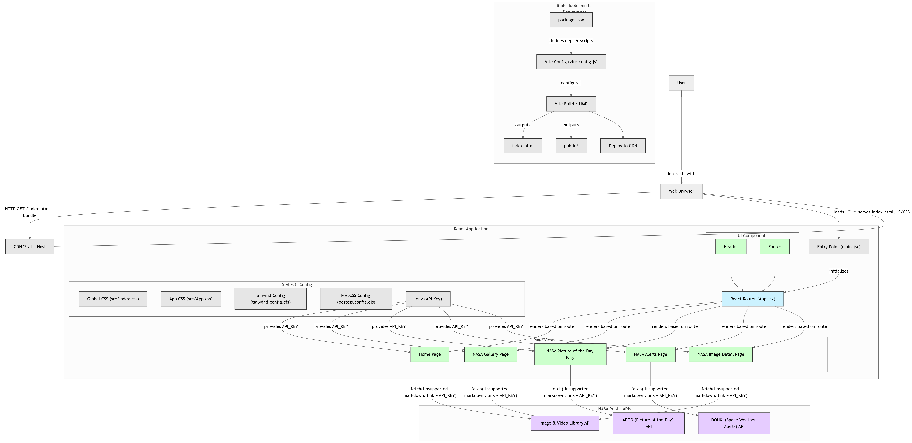

```markdown
# 🚀 NASA Explorer

Explore the universe with NASA's public APIs. This React-based web app lets you browse high-quality space images, get the Astronomy Picture of the Day, view live space weather alerts, and more — all in one beautifully styled interface.

---

## 🌌 Features

- 🖼️ **NASA Image Gallery** — Browse a rich gallery of space imagery from NASA.
- 📅 **Picture of the Day** — Daily updated images with descriptions using NASA's APOD API.
- 🚨 **Space Alerts** — Get real-time solar activity and space weather alerts.
- 🧠 **About Section** — Learn about data sources and the purpose of the project.

---

## 📸 Preview
```

## 

> Responsive UI powered by Tailwind CSS and React Router.

---

## 🛠️ Tech Stack

- ⚛️ **React** with Hooks
- 🌐 **React Router DOM** for page routing
- 🎨 **Tailwind CSS** for responsive design
- 🚀 **NASA APIs**
  - [NASA Image & Video Library](https://images.nasa.gov/)
  - [APOD (Astronomy Picture of the Day)](https://api.nasa.gov/)
  - [DONKI (Alerts)](https://api.nasa.gov/)

---

## 📦 Installation

```bash
git clone https://github.com/ramgopal-reddy/SpaceExplore.git
cd SpaceExplore
npm install
npm start
```

## 📁 Folder Structure

```
src/
├── assets/               # Images and static assets
├── components/           # Header, Footer, and shared components
├── pages/                # Home, Gallery, Alerts, etc.
│   ├── Home.jsx
│   ├── NasaGallery.jsx
│   ├── NasaPictureOfDay.jsx
│   ├── NasaAlerts.jsx
│   └── NasaImageDetail.jsx
├── App.jsx               # Main routing setup
├── App.css
└── index.js

```

## 

---

## 🌐 Live Demo

🔗 [https://space-explore-beige.vercel.app](https://space-explore-beige.vercel.app)

---

## 🔑 API Key Setup

This project uses NASA's public APIs. You can get your own API key at [https://api.nasa.gov](https://api.nasa.gov) and:

1. Create a `.env` file in the root:

   ```env
   REACT_APP_NASA_API_KEY=your_api_key_here
   ```

2. Access it in components:

   ```js
   const apiKey = process.env.REACT_APP_NASA_API_KEY;
   ```

---

## 👤 Author

**Your Name**
🔗 [Portfolio](https://yourportfolio.com)
🔗 [LinkedIn](https://linkedin.com/in/ramgopal-reddy)
🔗 [GitHub](https://github.com/ramgopal-reddy)
🔗 [Devpost](https://devpost.com/redabothularamgopalreddy)

---

## 📃 License

This project is licensed under the [MIT License](LICENSE).

---

### 🌟 Show your support

If you like this project, feel free to ⭐️ the repo or contribute!

```

```

```

```
